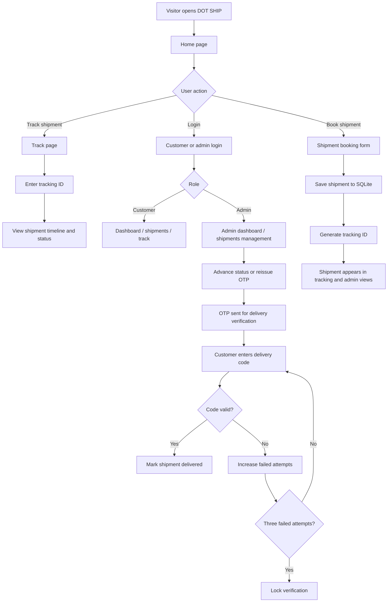

# DOT SHIP

A premium web-based courier and parcel management system built with PHP 8+, SQLite, HTML5, CSS3, and Bootstrap 5.

## Folder Structure

```text
DOT SHIP/
├─ admin/
├─ assets/
│  ├─ css/
│  ├─ img/
│  └─ js/
├─ config/
├─ includes/
├─ composer.json
├─ index.php
├─ login.php
├─ register.php
├─ dashboard.php
├─ book.php
├─ shipments.php
├─ track.php
└─ logout.php
```

## Requirements

- PHP 8.0 or later
- SQLite support via the bundled PHP PDO driver
- Composer
- No external database server is required for the demo; the app uses SQLite storage in `storage/dotship.sqlite`

## Setup

1. Install dependencies.

```bash
composer install
```

2. Copy `.env.example` to `.env` if you want custom values and adjust the app settings.

3. If you want to use a custom SQLite file, set `DOTSHIP_SQLITE_PATH`.

4. The default demo works out of the box with no database server setup.

5. Start the project from the workspace root.

```bash
php -S 127.0.0.1:8000
```

6. Open the app in your browser.

```text
http://127.0.0.1:8000
```

## Default Demo Accounts

- Admin: `admin@dotship.local` / `Admin@1234`
- Customer: `demo@dotship.local` / `Demo@1234`

## Notes

- The app seeds demo users and sample shipments on first run.
- Tracking is available publicly from the landing page.
- Admin routes live under `admin/`.

## Project Flow Chart



## GitHub and free deployment

- GitHub Pages cannot run PHP, so use GitHub only for source control.
- For a free viva deployment, upload the project to a free PHP host that gives you a public web URL.

## Quick deploy summary

1. Push code to GitHub.
2. Create a free PHP hosting account.
3. Upload the project files to the web root.
4. Make `storage/` writable.
5. Open the site and use the demo login.

## Live Demo Flow

Use this sequence during your viva:

1. Open the app home page.
2. Log in as the demo customer.
3. Book a shipment.
4. Open the tracking page and show the status timeline.
5. Log in as admin.
6. Open the admin shipment page and advance a shipment.
7. Send an OTP from the admin page.
8. Go back to tracking and verify the OTP.
9. Show that the shipment status updates automatically.
10. Use revert/backtracking once to show admin control.

### Suggested talking points

- “This system is built in PHP with SQLite-backed storage.”
- “The admin can manage shipment state, but the customer can also verify delivery through OTP.”
- “The tracking page shows the live shipment timeline.”
- “The revert action shows backtracking support for corrections.”

### If you are running locally

Start the site with XAMPP and open the app in your browser.

```powershell
& 'C:\xampp\php\php.exe' -S 127.0.0.1:8000
```

Then visit:

```text
http://127.0.0.1:8000
```